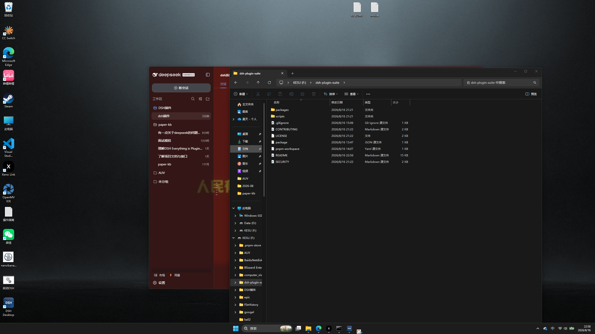
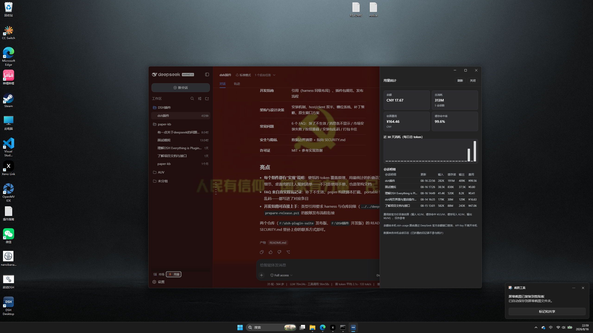
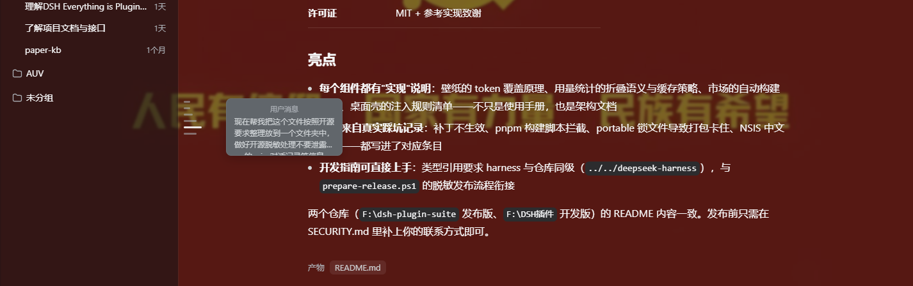
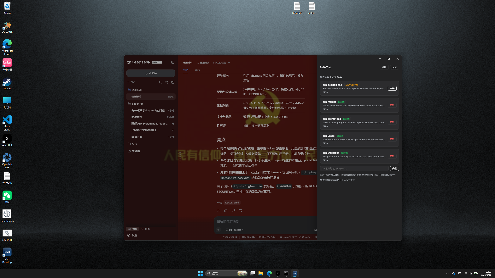

# dsh-plugin-suite

**DeepSeek Harness（DSH）插件套件** —— 一个仓库、多个独立插件包，为
[dsh web](https://github.com/deepseek-ai/deepseek-harness) 提供桌面化体验、壁纸与毛玻璃视觉、
用量统计、对话消息跳转条与插件市场，并附一个 Electron 桌面壳。

> 已验证环境：DeepSeek Harness `0.1.0-rc.5`（commit `47f943859b`）、Windows 11、
> Node ≥ 22、pnpm ≥ 10。

---

## 目录

- [组件一览](#组件一览)
- [环境要求](#环境要求)
- [快速开始](#快速开始)
- [组件详解](#组件详解)
  - [dsh-wallpaper：壁纸与毛玻璃](#dsh-wallpaper壁纸与毛玻璃)
  - [dsh-usage：用量统计](#dsh-usage用量统计)
  - [dsh-prompt-rail：对话消息跳转条](#dsh-prompt-rail对话消息跳转条)
  - [dsh-market：插件市场](#dsh-market插件市场)
  - [dsh-desktop-shell：Electron 桌面壳](#dsh-desktop-shellelectron-桌面壳)
- [开发指南](#开发指南)
- [架构与设计决策](#架构与设计决策)
- [常见问题](#常见问题)
- [安全与隐私](#安全与隐私)
- [许可证](#许可证)

---

## 组件一览

| 包 | 功能 | 形态 |
|---|---|---|
| [packages/dsh-wallpaper](packages/dsh-wallpaper) | 壁纸 + 界面内毛玻璃：面板半透明/模糊、显示方式、本地图/URL | Web 插件 |
| [packages/dsh-usage](packages/dsh-usage) | 用量统计：余额、按日/按会话统计、费用估算、缓存命中率 | Web 插件 |
| [packages/dsh-prompt-rail](packages/dsh-prompt-rail) | 对话消息跳转条：悬停预览、点击跳转、用户/助手双标记 | Web 插件（需内核补丁） |
| [packages/dsh-market](packages/dsh-market) | 插件市场：浏览/一键安装/卸载、git URL 安装、自动构建 | Web 插件 |
| [packages/dsh-desktop-shell](packages/dsh-desktop-shell) | Electron 桌面壳：毛玻璃边框、原生窗口按钮、托盘、内嵌服务器 | 独立应用 |

Web 插件装入 `web` profile 后，在浏览器与桌面壳中同时生效。

## 界面预览

桌面壳 + 壁纸与毛玻璃的整体效果：



---

## 环境要求

| 依赖 | 版本 | 说明 |
|---|---|---|
| [DeepSeek Harness](https://github.com/deepseek-ai/deepseek-harness) | `0.1.0-rc.5` 验证 | 源码 checkout（`dsh web` 从源码运行） |
| Node.js | ≥ 22 | harness 与构建需要 |
| pnpm | ≥ 10 | 插件构建与依赖安装 |
| Windows | 11 22H2+（推荐） | 桌面壳的 acrylic 毛玻璃材质需要；Win10 回退为深色边框 |
| Git | 任意较新版本 | 插件市场 git 安装 |

> macOS / Linux 上 Web 插件可用；桌面壳按 Windows 优先设计（原生按钮覆盖层、acrylic
> 材质均为 Windows 特性，其他平台自动降级为无边框窗口）。

---

## 快速开始

### 1. 安装 Web 插件到 profile

```powershell
# 构建（typecheck + 产出 lib/）
pnpm install
pnpm build

# 逐个安装（或直接使用仓库中的 install-and-restart.bat 一步到位）
node scripts/install-plugin.mjs packages/dsh-wallpaper
node scripts/install-plugin.mjs packages/dsh-usage
node scripts/install-plugin.mjs packages/dsh-market
```

安装脚本会把构建产物拷入 `$DSH_HOME/profiles/node_modules/@local/<name>/`，并在
`$DSH_HOME/profiles/web/cordis.patch.yml` 追加 loader insert——不经过 pnpm/registry。

**消息条（dsh-prompt-rail）需要先给 harness 打补丁**，见
[组件详解](#dsh-prompt-rail对话消息跳转条)。

### 2. 重启 dsh web 并验证

```powershell
# 停止 3080 上的 dsh web → 装全部插件 → 重启并打开页面
scripts\install-and-restart.bat <harness-root>

# 或手动：重启后浏览器 Ctrl+F5 强刷
```

侧边栏底部应出现 🛒（市场）与 ⚡（用量）入口；设置 → 通用 出现「壁纸」；打开会话可见
消息跳转条。

### 3. 桌面壳（可选）

```powershell
cd packages/dsh-desktop-shell
pnpm install
pnpm start
```

---

## 组件详解

### dsh-wallpaper：壁纸与毛玻璃

**入口**：设置 → 通用 → 壁纸

- **选图**：本地图片（自动压缩为 data URL，≤1.8MB）或粘贴 http(s)/data 图片地址
- **毛玻璃联动**：面板不透明度（wash）与模糊（blur）滑块——主画布/侧边栏半透明后
  壁纸透出，配合模糊形成毛玻璃；消息气泡保持不透明保证可读性
- **显示方式**：铺满 / 完整显示 / 拉伸 / 平铺
- **持久化**：localStorage（第三方设置 namespace 不在 host allowlist 内）

**实现**：浏览器端插件——`position: fixed` 背景层（`z-index: -1`）+ `ctx.theme.overrideTokens`
把 `--dsw-alias-bg-base` 与 `--dsw-specific-sidebar-fill` 变为半透明。桌面壳下背景层自动
对齐窗口圆角（`.dsh-wallpaper-layer` 规则），浏览器下保持全窗。

### dsh-usage：用量统计

**入口**：侧边栏底部 ⚡ 按钮（市场下方）→ 抽屉面板

- **余额**：经 host 侧路由调用官方 `GET https://api.deepseek.com/user/balance`；
  API key 通过 DSH 凭据缝隙（`ctx.credentials`，默认环境变量 `DEEPSEEK_API_KEY`）解析，
  **key 不出宿主进程**
- **统计**：总消耗（输入/输出/缓存读/缓存写）、近 30 天按日柱状图、会话明细表（标题/
  更新时间/各桶 token/费用）、缓存命中率、费用估算
- **费用估算**：内置官方价目表（`src/pricing.ts` 可编辑），标注「估算」而非账单
- **数据来源**：host 侧折叠每个会话的持久日志（last-wins 每 turn/step 用量样本，与
  token-meter 投影语义一致）；已压缩（compaction）的历史不参与统计
- **性能**：结果 15s 缓存 + 余额 60s 缓存 + 启动后台预热——面板打开毫秒级返回
- **接口**：`GET /api/dsh-usage/overview`



### dsh-prompt-rail：对话消息跳转条

**入口**：打开任意会话，聊天区左侧的垂直跳转条

- 每个**用户消息**与**助手消息**一个刻度（助手为短暗标记）
- 悬停/键盘聚焦：刻度放大 + 预览气泡（最多 4 行文本 + 角色标签）
- 点击：滚动到对应消息；选中的刻度保持品牌色

**前置条件（重要）**：`conversation.chat.navigator` 槽位在 upstream harness 中**不存在**
（验证于 `47f943859b`）。本仓库自带补丁：

```powershell
# 在干净的 harness checkout 中：
git apply <repo>/packages/dsh-prompt-rail/compat/patches/harness-navigator-slot.patch
pnpm --filter @deepseek-ai/dsh-client-ui-conversation run bundle
npx tsc -b tsconfig.client.json
```

补丁同时扩展了槽位：助手消息可寻址、摘要最长 400 字符。更新 harness 后需重新打补丁
（补丁针对具体 revision 编写，若冲突需人工适配）。



### dsh-market：插件市场

**入口**：侧边栏底部 🛒 按钮（用量上方）→ 抽屉面板

- **本地仓库**：扫描 `$DSH_MARKET_REPO`（或 `~/dsh-plugin-suite`）下 `packages/*`，
  展示名称/描述/版本/状态；一键安装/卸载
- **git URL 安装**：粘贴 `https://` 仓库地址 → 浅克隆 → 自动识别单包或 workspace 结构
- **自动构建**：包没有 `lib/` 时自动执行 `pnpm install`（有 workspace 配置时在根目录；
  自动注入 `dangerouslyAllowAllBuilds` 以放行依赖构建脚本）+ 包内 `build`/`bundle` 脚本，
  构建产物校验通过后安装；失败给出可读错误（含输出尾部）
- **安装/卸载后需重启 dsh web 生效**（运行中的服务器不重扫 profile）

**接口**：`GET /api/dsh-market/catalog`、`POST /api/dsh-market/install`（repo|git）、
`POST /api/dsh-market/uninstall`。文件与补丁操作全部在 host 侧。



### dsh-desktop-shell：Electron 桌面壳

**效果**

- **毛玻璃边框**：无边框窗口 + Windows 11 原生 acrylic 材质（覆盖非客户区）——窗口边距
  与标题栏条带透出桌面磨砂；Win10 回退深色背景
- **原生窗口按钮**：最小化/最大化/关闭由 Window Controls Overlay（OS 层）绘制，永不与
  页面内容重叠；标题栏区域原生可拖拽；窗口边缘原生调整大小
- **内嵌服务器**：启动时在 harness checkout 拉起 `pnpm dsh web --port 3080`（端口被占用
  则直接连接已有服务），退出时一并停止（进程树清理）
- **系统托盘**：关闭窗口驻留托盘，双击恢复；单实例锁
- **注入样式**：页面内容为圆角卡片（8px 与系统圆角一致）、壁纸层全窗圆角裁剪、
  会话头部按钮（Session log）单独下沉避开控制条带、全屏对话框保持居中

**配置**：环境变量 `DSH_DESKTOP_HARNESS` / `DSH_DESKTOP_PORT` / `DSH_DESKTOP_CONFIG`；
配置文件 `dsh-desktop.config.json`（开发模式在应用目录，打包后默认在 userData）。

**打包分发**

```powershell
cd packages/dsh-desktop-shell
pnpm run dist            # NSIS 安装包 + portable 免安装版（dist/）
pnpm run dist:nsis       # 仅安装包
pnpm run dist:portable   # 仅免安装版
```

- `asar: false`：`resources/app` 为裸目录，改壳代码可直接编辑重启，无需重打包
- 安装包强制 Unicode NSIS + 仅英文安装向导（规避中文系统上安装器界面乱码）
- 工具链下载走镜像：`ELECTRON_MIRROR` / `ELECTRON_BUILDER_BINARIES_MIRROR`
  （国内环境建议设置为 npmmirror 对应地址）
- **注意**：打包前先退出正在运行的壳实例（运行中的 portable stub 会锁定输出文件，
  导致打包卡在 portable 阶段）
- 自检：`DSH Desktop.exe --smoke`（退出码 0 = 页面就绪 + 注入规则生效 + 插件零加载错误）；
  `--verbose` 输出弹窗/布局诊断并可写入 `%APPDATA%\dsh-desktop-shell\dsh-desktop.log`

---

## 开发指南

### 目录布局

```
dsh-plugin-suite/
├── packages/
│   ├── dsh-wallpaper/        # Web 插件：壁纸 + 毛玻璃
│   ├── dsh-usage/            # Web 插件：用量统计（host 路由 + 浏览器面板）
│   ├── dsh-prompt-rail/      # Web 插件：消息跳转条 + harness 补丁
│   ├── dsh-market/           # Web 插件：插件市场（host 路由 + 浏览器面板）
│   └── dsh-desktop-shell/    # Electron 应用（独立于 profile）
├── scripts/
│   ├── install-plugin.mjs    # 插件安装（@local 布局 + patch insert，幂等）
│   ├── install-and-restart.bat
│   ├── build-all.mjs
│   ├── generate-icon.ps1
│   └── prepare-release.ps1   # 生成脱敏发布文件夹
```

### 开发循环

```powershell
pnpm install                        # workspace 工具链
pnpm -C packages/<name> run check   # typecheck + build
node scripts/install-plugin.mjs packages/<name>   # 装入 web profile
pnpm dsh web --port 3081            # 独立验证实例（不干扰 3080）
```

### 类型引用

各包 `tsconfig.json` 的 `paths` 指向 **与仓库同级的 harness checkout**（相对路径
`../../deepseek-harness/...` 的预构建 `lib/types`）：

```
dev/
├── deepseek-harness/     # upstream checkout
└── dsh-plugin-suite/     # 本仓库
```

运行时类型在 profile 中解析，与开发期类型保证一致。

### 插件包规范

- 包名使用 `@local/` 作用域（手动安装约定：loader 条目 id == 包名 == bundle 注册 id）
- `src/index.ts`：host 半（no-op 或注册路由）；`src/client/index.ts`：浏览器半
  （`apply(ctx)` + `ctx.slots.inject`）
- `lib/` 预构建产物**提交入库**（profile 安装不执行构建；市场自动构建针对无 lib 的
  第三方包）
- 文案：`src/client/locales.ts` 提供 zh + en 双字典

### 发布流程

```powershell
pwsh -File scripts\prepare-release.ps1   # 复制到发布目录并脱敏
```

发布目录自动排除 node_modules/dist/.git/sourcemap/exe，并替换开发机路径
（用户名、绝对仓库路径）。发布前用 `git log` 复核提交信息，确保不含敏感内容。

---

## 架构与设计决策

- **安装机制**：`@local` 布局 + `cordis.patch.yml` insert——零 registry 依赖、版本与
  checkout 完全对齐；`install-plugin.mjs` 与市场共用同一套规则
- **host/client 双半**：浏览器只做展示；文件操作、网络（余额/克隆/构建）全部在 host
  进程——API key 与 profile 数据不进入浏览器
- **槽位系统**：浏览器 UI 通过 `ctx.slots.inject` 注册（settings.general.item、
  sidebar.footer.action、conversation.chat.navigator），与内置 `ui-*` 包同一机制
- **消息条补丁**：upstream 无导航槽位，采用「精确补丁 + 重建」策略（compat 目录工件化）
- **桌面壳**：放弃 CSS 自绘窗口控制（透明窗口在 Windows 上的命中/缩放不可靠），改用
  原生 Overlay + acrylic——稳定性优先，视觉由注入 CSS 承担

---

## 常见问题

**装了插件没生效？**
运行中的 dsh web 不重扫 profile。重启服务器并 Ctrl+F5 强刷；
`install-and-restart.bat` 一键完成。

**消息条不显示？**
先确认 harness 补丁已应用且 ui-conversation 已重建（见组件详解）。纯浏览器下
`conversation.chat.navigator` 槽位不存在时消息条不会渲染。

**市场安装报「依赖安装失败」？**
报错尾部会给出原因。常见为网络问题（registry 不可达）或 pnpm 未安装；
依赖构建脚本拦截问题已通过自动注入 `dangerouslyAllowAllBuilds` 处理。

**市场/用量面板按钮与窗口按钮重叠？**
桌面壳的按钮是原生覆盖层（OS 层），不会与页面内容重叠；若面板自身布局异常，
升级到最新版（面板已适配顶部条带）。

**安装包向导乱码？**
已知问题（中文系统 + NSIS 语言文件编码），已通过强制 Unicode + 仅英文向导修复。

**打包卡住？**
多半是正在运行的壳实例锁住了输出文件——先退出壳再打包。

---

## 安全与隐私

详见 [SECURITY.md](SECURITY.md)。要点：

- 全部本地运行，无遥测、无数据收集
- API key 存于 DSH 凭据存储（`$DSH_HOME/.credentials.yaml` 或环境变量），不入仓库
- 会话数据留在 `$DSH_HOME/sessions`，本仓库不含任何对话记录
- 安装第三方插件 = 执行其代码与构建脚本，仅安装信任来源的插件

---

## 许可证

MIT —— 见 [LICENSE](LICENSE)。各包与参考实现（dsh-skin、dsh-bg-image、prompt-rail）均为 MIT。
